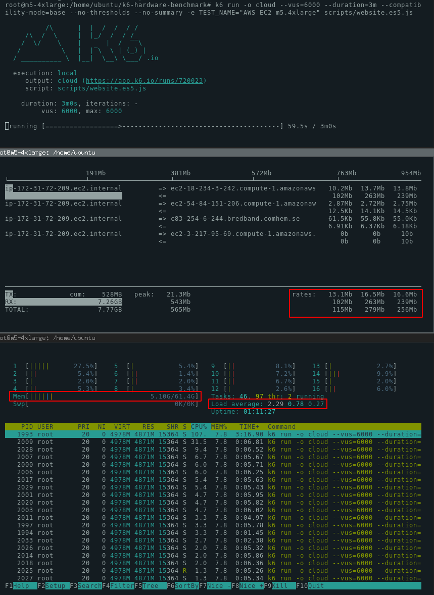

Este documento explica cómo lanzar una prueba k6 a gran escala en una sola máquina sin necesidad de una ejecución distribuida.

El error más común de muchos probadores de carga es que la ejecución distribuida (capacidad de lanzar una prueba de carga en múltiples máquinas) es necesaria para generar una gran carga. Este no es el caso de k6.

k6 es diferente de muchas otras herramientas de pruebas de carga en la forma en que maneja los recursos de hardware. Un solo proceso de k6 utilizará eficientemente todos los núcleos de la CPU en una máquina generadora de carga. Una sola instancia de k6 suele ser suficiente para generar una carga de 30.000 - 40.000 usuarios simultáneos (VUs). Esta cantidad de VUs puede generar más de 300.000 peticiones por segundo (RPS).

A menos que necesite más de 100.000 - 300.000 peticiones por segundo (6 - 12M de peticiones por minuto), una sola instancia de k6 será probablemente suficiente para sus necesidades.

A continuación exploraremos qué hardware y consideraciones se necesitan para generar diferentes niveles de carga.


## Optimización del Sistem Operativo

Los siguientes cambios en el sistema operativo permiten a k6 utilizar toda la capacidad de red de la máquina para obtener el máximo rendimiento.

```bash
sysctl -w net.ipv4.ip_local_port_range="1024 65535"
sysctl -w net.ipv4.tcp_tw_reuse=1
sysctl -w net.ipv4.tcp_timestamps=1
ulimit -n 250000
```

Estos comandos permiten reutilizar las conexiones de red, aumentar el límite de conexiones de red y el rango de puertos locales.

Para aplicar estos cambios, puedes pegar estos comandos como usuario root antes de ejecutar una prueba k6 o cambiar los archivos de configuración en tu sistema operativo.

Para obtener información detallada sobre estos ajustes, las instrucciones de macOS y cómo hacerlos permanentes, consulta nuestro artículo ["Ajuste del sistema operativo"](/es/misc/optimizar-el-sistema-operativo/).

## Consideraciones sobre el hardware

### Red

El rendimiento de la red de la máquina es una consideración importante cuando se ejecutan grandes pruebas. Muchas máquinas AWS EC2 vienen con una conexión de 1 Gbit/s que puede limitar la cantidad de carga que k6 puede generar.

Cuando se ejecuta la prueba, se puede utilizar `iftop` en el terminal para ver en tiempo real la cantidad de tráfico de red generado. Si el tráfico es constante a 1Gbit/s, su prueba está probablemente limitada por la tarjeta de red. Considere la posibilidad de actualizar a una instancia EC2 diferente.

### CPU

A diferencia de muchas otras herramientas de pruebas de carga, k6 es una herramienta multihilo. Utilizará efectivamente todos los núcleos disponibles de la CPU simultáneamente.

La cantidad de CPU que necesita depende de sus archivos de prueba (a veces llamados script de prueba). Independientemente del archivo de prueba, puede asumir que las pruebas grandes requieren una cantidad significativa de CPU. Le recomendamos que dimensione la máquina para tener al menos un 20% de ciclos de inactividad (hasta un 80% utilizado por k6, 20% de inactividad). Si k6 utiliza el 100% para generar carga, no tendrá suficiente CPU para medir las respuestas correctamente. Esto puede hacer que las métricas de resultados tengan un tiempo de respuesta mucho mayor que en la realidad.

### Memoria

A k6 le gusta la memoria, pero no es tan codicioso como [otras herramientas de pruebas de carga](https://k6.io/blog/comparing-best-open-source-load-testing-tools#memory-usage). El consumo de memoria depende en gran medida de sus escenarios de prueba. Para estimar el requerimiento de memoria de su prueba, ejecute la prueba en su máquina de desarrollo con 100 VUs y multiplique la memoria consumida por el número objetivo de VUs.

Las pruebas sencillas utilizarán entre 1 y 5 MB por VU. (1000VUs = 1-5GB). Las pruebas que utilizan cargas de archivos pueden consumir decenas de megabytes por VU.

## Consejos generales


### Haga que su código de prueba sea resistente

Cuando se ejecutan grandes pruebas de estrés, su script no puede asumir nada sobre la respuesta HTTP. A menudo, las pruebas de rendimiento se escriben con una "ruta feliz" en mente. Por ejemplo, una comprobación de "camino feliz" como la siguiente es algo que vemos en k6 a menudo.

```javascript
import { check } from 'k6';
import http from 'k6/http';

const res = http.get('https://test.k6.io');
const checkRes = check(res, {
  'Homepage body size is 11026 bytes': (r) => r.body.length === 11026,
});
```

Un código como éste funciona bien cuando el sistema bajo prueba (SUT) no está sobrecargado y devuelve respuestas adecuadas. Cuando el sistema empieza a fallar, la comprobación anterior no funciona como se espera.

El problema aquí es que la comprobación asume que siempre hay un cuerpo en una respuesta. El r.body puede no existir si el servidor está fallando. En tal caso, la comprobación no funcionará como se espera y se devolverá un error similar al que se muestra a continuación:

```bash
ERRO[0625] TypeError: Cannot read property 'length' of undefined
```

Para solucionar este problema sus comprobaciones deben ser resistentes a cualquier tipo de respuesta. Este cambio solucionará el problema anterior.

<CodeGroup labels={["resilient check"]}>

```javascript
import { check } from 'k6';
import http from 'k6/http';

const res = http.get('https://test.k6.io');
const checkRes = check(res, {
  'Homepage body size is 11026 bytes': (r) => r.body && r.body.length === 11026,
});
```

</CodeGroup>

### Monitorizar el servidor generador de carga

Si está ejecutando una prueba por primera vez, una buena idea es mantener un ojo en los recursos disponibles mientras se ejecuta la prueba. La forma más fácil de hacerlo es conectarse por SSH al servidor con 3 sesiones:

1. Para ejecutar k6
2. Para monitorizar la CPU y la memoria
3. Para monitorizar la red

Para monitorizar la CPU y la memoria recomendamos [htop](https://en.wikipedia.org/wiki/Htop). Para monitorear la red, recomendamos [iftop](https://en.wikipedia.org/wiki/Iftop).

Aquí hay una captura de pantalla de 3 sesiones de terminal mostrando k6, iftop y htop.



## Opciones de k6

Las opciones de k6 que se enumeran a continuación permitirán obtener ventajas de rendimiento adicionales cuando se ejecuten pruebas de gran envergadura.

### --compatibility-mode=base

La opción más impactante para mejorar el rendimiento de k6 es usar [`--compatibility-mode=base`](/using-k6/options/#compatibility-mode) para deshabilitar la transpilación de [Babel](https://babeljs.io/)  y ejecutar un script en  ES5.1+.  


```bash
# compatibility-mode=base disables the Babel transpilation and the inclusion of corejs 
k6 run --compatibility-mode=base yourscript.es5.js
```

> **Background**
> 
> La mayoría de los ejemplos de k6 están escritos en ES6+.
> 
> Por defecto, k6 transpila el código de  ES6+ a ES5.1 usando Babel y cargando la librería corejs para habilitar APIs comúnmente usadas. 
> Ésto funciona bien para el 99% de los casos, pero añade una sobrecarga con test de carga grandes. 
> 
> Si ejecuta el script en ES5.1 en ves del original en ES6+, k6 puede usar un 50-85% de memoría y reducir significantemente la CPU y tiempo de inicio. 

Puede usar [webpack](https://webpack.js.org/) para transpilar el script fuera de k6.

Si usa el repositorio [k6-hardware-benchmark](https://github.com/grafana/k6-hardware-benchmark), puede usar las siguientes instrucciones: 

```bash
git clone https://github.com/grafana/k6-hardware-benchmark/
cd k6-hardware-benchmark
yarn install

yarn run to-es5 someplace/yourscript.js
# builds the ES5 script in someplace/yourscript.es5.js

k6 run --compatibility-mode=base someplace/yourscript.es5.js
```


### discardResponseBodies

Puede decirle a k6 que no procese el cuerpo de la respuesta estableciendo `discardResponseBodies` en el objeto de opciones de la siguiente manera:

```javascript
export const options = {
  discardResponseBodies: true,
};
```

k6 por defecto carga el cuerpo de la respuesta de la solicitud en la memoria. Esto provoca un consumo de memoria mucho mayor y a menudo es completamente innecesario. Si necesita el cuerpo de la respuesta para algunas peticiones puede establecer [Params.responseType](/javascript-api/k6-http/params).

### --no-thresholds --no-summary

Si está ejecutando una prueba local y transmitiendo los resultados a la nube (k6 run -o cloud), es posible que desee desactivar el resumen de la terminal y el cálculo del umbral local, ya que los umbrales y el resumen se mostrarán en la nube. Esto le ahorrará algo de memoria y ciclos de CPU.

```bash
k6 run scripts/website.es5.js \
  -o cloud \
  --vus=20000 \
  --duration=10m \
  --compatibility-mode=base \
  --no-thresholds \
  --no-summary \
```

### Eliminar comprobaciones, grupos y métricas personalizadas innecesarias

Si todo lo demás ha fallado y está tratando de exprimir más el rendimiento del hardware, puede considerar la posibilidad de optimizar el código de la propia prueba de carga.

**Checks y groups**

k6 registra el resultado de cada Check y Group por separado. Si está utilizando muchos Checks y Groups, puede considerar eliminarlas para aumentar el rendimiento.

**Métricas personalizadas**

Al igual que las comprobaciones, los valores de las métricas personalizadas (Trend, Counter, Gauge and Rate) se registran por separado. Considere minimizar el uso de las métricas personalizadas.

**Thresholds con abortOnFail**

Si ha configurado [abortOnFail thresholds](/using-k6/thresholds#aborting-a-test-when-a-threshold-is-crossed), k6 necesita evaluar el resultado constantemente para verificar que no se ha superado el Threshold. Considere la posibilidad de eliminar esta configuración.

## Pruebas de carga de archivos

Hay que tener en cuenta consideraciones especiales a la hora de probar la carga de archivos.

### Rendimiento de la red

El rendimiento de la red de la máquina generadora de carga, así como del SUT, será probablemente el cuello de botella.

### Memoria

k6 necesita una cantidad significativa de memoria al cargar archivos, ya que cada VU es independiente y tiene su propia memoria.

### Costes de transferencia de datos

k6 puede cargar una gran cantidad de datos en un periodo de tiempo muy corto. Asegúrese de conocer los costes de transferencia de datos antes de iniciar una prueba a gran escala.

La transferencia de datos salientes es cara en AWS EC2. El precio oscila entre 0,08$ y 0,20$ por GB dependiendo de la región. Si utiliza la región más barata, el coste es de unos 0,08 dólares por GB. Subir 1TB, por tanto, cuesta unos 80 dólares. Una prueba de larga duración puede costar varios cientos de dólares sólo en transferencia de datos.

### Costes de EC2

Las instancias de AWS EC2 son relativamente baratas. Incluso la instancia más grande que hemos utilizado en este benchmark (m5.24xlarge) sólo cuesta 4,6 dólares por hora. Asegúrate de apagar los servidores generadores de carga una vez que hayas terminado con tus pruebas. El servidor EC2 olvidado costará 3312 dólares al mes.
Consejo: a menudo es posible lanzar "instancias puntuales" del mismo hardware por un 10-20% del coste.


## Errores

Si te encuentras con errores durante la ejecución, es bueno entender si fueron causados por el generador de carga o por que el servicio siendo testeado falla.

### read: connection reset by peer

Un error similar a éste es causado por el sistema de destino que restablece la conexión TCP. Esto sucede cuando el balanceador de carga o el propio servidor no son capaces de manejar el tráfico.

```bash
WARN[0013] Request Failed       error="Get http://test.k6.io: read tcp 172.31.72.209:35288->63.32.205.136:80: read: connection reset by peer"
```

### context deadline exceeded

Este tipo de error se produce cuando k6 ha podido enviar una petición, pero el sistema de destino no ha respondido a tiempo. El tiempo de espera por defecto en k6 es de 60 segundos. Si su sistema no produce la respuesta en este plazo, aparecerá este error.

```bash
WARN[0064] Request Failed    error="Get http://test.k6.io: context deadline exceeded"
```

### dial tcp 52.18.24.222:80: i/o timeout

Este es un error similar al anterior, pero en este caso, k6 ni siquiera fue capaz de hacer una petición. El sistema de destino no es capaz de establecer una conexión.

```bash
WARN[0057] Request Failed     error="Get http://pawel.staging.loadimpact.com/static/logo.svg?url=v3: dial tcp 52.18.24.222:80: i/o timeout"
```

### socket: too many open files

Este error significa que la máquina generadora de carga no es capaz de abrir sockets TCP porque ha alcanzado el límite de archivo abiertos. Asegúrese de que su límite está configurado lo suficientemente alto `ulimit -n 250000` debería ser suficiente para cualquiera :tm:

```bash
WARN[0034] Request Failed     error="Get http://99.81.83.131/static/logo.svg?ip=6: dial tcp 99.81.83.131:80: socket: too many open files"
```

Nota: usted debe decidir qué nivel de errores es aceptable. A gran escala, siempre hay algunos errores. Si se realizan 50M de peticiones con 100 fallos, este es generalmente un buen resultado (0,00002% de errores).

## Benchmarking k6 en AWS

Hemos ejecutado algunas pruebas grandes en diferentes máquinas EC2 para ver cuánta carga puede generar k6. Nuestra observación general es que k6 escala proporcionalmente al hardware. Una máquina 2 veces más grande es capaz de generar 2 veces más tráfico. El límite de esta escalabilidad está en el número de conexiones abiertas. Una sola máquina Linux puede abrir hasta 65 535 sockets por IP. Esto significa que un máximo de 65k peticiones pueden ser ejecutadas simultáneamente en una sola máquina. El límite de RPS depende del tiempo de respuesta del SUT. Si las respuestas se entregan en 100 ms, el límite de RPS es de 650 000.

### Real-life test of a website.

Probar los límites teóricos es divertido, pero ese no es el objetivo de este benchmark. El punto de este benchmark es dar a los usuarios una indicación de cuánto tráfico puede generar k6 al ejecutar pruebas complicadas de la vida real. Para ello, hemos escrito una [prueba](https://github.com/grafana/k6-hardware-benchmark/blob/master/scripts/website.js) de un sitio web de la vida real bastante pesado que utiliza casi todas las características de k6.

Configuración:

- Todas las pruebas se ejecutaron en instancias de AWS EC2
- NO se utilizó la recomendación "discardResponseBodies". (los resultados serían mejores con esta configuración).
- Los scripts utilizados para las pruebas están disponibles en el directorio /scripts. Los resultados son reproducibles se utilizó k6 v0.26.2
- Nota: el sistema de destino (test.k6.io) se ejecutó en un gran clúster para aumentar el rendimiento.
- Nota: el sistema de destino (test.k6.io) es un sitio web PHP lento, no optimizado para el rendimiento; un sitio web estático sería mucho más rápido.

El archivo de prueba "website.js" utiliza una amplia gama de características de k6 para que la prueba emule un uso real de k6. No se trata de una prueba manipulada para el rendimiento, sino todo lo contrario. Esta prueba utiliza un montón de métricas personalizadas, Checks, parametrización, http.batch, Thresholds y Groups. Es una prueba pesada que debería representar bien un caso real.

**> Servidor AWS m5.large EC2**

La instancia `m5.large` tiene 8GB de RAM y 2 núcleos de CPU.

El siguiente comando fue utilizado para ejecutar la prueba


```bash
k6 run scripts/website.es5.js \
 -o cloud \
 --vus=6000 \
 --duration=10m \
 --compatibility-mode=base \
 --no-thresholds \
 --no-summary
```

Resultados

- Maximum VUS reached: 6000
- Memory used: 6.09 GB (out of 8.0)
- CPU load (avg): 1.49 (out of 2.0).
- Peak RPS: ~6000 (note, this test was not optimized for RPS).
- 2x `sleep(5)` in each iteration.

**> AWS m5.4xlarge**

The `m5.4xlarge` instance has 64GB of RAM and 16 CPU cores.

```bash
k6 run scripts/website.es5.js \
   -o cloud  \
   --vus=20000 \
   --duration=10m \
   --compatibility-mode=base  \
   --no-thresholds  \
   --no-summary

```

Resultados

- Maximum VUS reached: 20.000
- Memory used: 20.1 GB (out of 61.4)
- CPU load (avg): 8.5 (out of 16.0).
- Peak RPS: ~20.000 (note, this test was not optimized for RPS).
- 2x `sleep(5)` in each iteration.

**> AWS m5.24xlarge**

The m5.24xlarge has 384GB of RAM and 96 CPU cores.
NOTA: el tiempo de espera se ha reducido a 1s en lugar de 5s para producir más peticiones.


```bash
k6 run scripts/website.es5.js  \
   -o cloud  \
   --vus=30000 \
   --duration=5m \
   --compatibility-mode=base  \
   --no-thresholds  \
   --no-summary
```

Resultados

- Maximum VUS reached: 30.000
- Memory used: ~120 GB (out of 370 available)
- CPU load (avg): ~45 (out of 96.0).
- Peak RPS: ~61.500.
- `sleep(1)` in each iteration.

### Pruebas de RPS


Como se dijo al principio, k6 puede producir muchas peticiones muy rápidamente, especialmente si el sistema de destino responde de manera rápida. Para probar el límite de RPS de nuestra aplicación hemos escrito una [prueba optimizada para RPS](https://github.com/grafana/k6-hardware-benchmark/blob/master/scripts/RPS-optimized.js). Desafortunadamente, nuestro sistema de destino test.k6.io es una aplicación PHP bastante lenta. Sin embargo, utilizando 30k VUs hemos alcanzado 188.000 RPS. Los números mucho más altos son posibles para sistemas más rápidos.

**> AWS m5.24xlarge**

```bash
k6 run scripts/RPS-optimized.es5.js \
   -o cloud  \
   --vus=30000  \
   --duration=1m  \
   --compatibility-mode=base  \
   --no-thresholds \
   --no-summary
```

Results

- Maximum VUS reached: 30.000
- Memory used: 24 GB (out of 370 available)
- CPU load (avg): 80 (out of 96.0).
- Peak RPS: ~188.500.

### Pruebas de transferencia de datos

k6 puede utilizar el ancho de banda de la red disponible cuando sube archivos, pero necesita mucha memoria para hacerlo.

Por favor, lea la advertencia sobre el coste de la transferencia de datos en AWS antes de comenzar una prueba a gran escala.


**> AWS m5.24xlarge**

Para probar el rendimiento de la red hemos escrito un [script de carga de archivos](https://github.com/grafana/k6-hardware-benchmark/blob/master/scripts/file-upload.js). Hemos ejecutado esta prueba durante sólo 1 minuto para minimizar los costes de transferencia de datos. En 1 minuto, k6 consiguió transferir 36 GB de datos con 1000 VUs.

```bash
k6 run scripts/file-upload.es5.js \
-o cloud \
--vus=1000 \
--duration=1m \
--compatibility-mode=base \
--no-thresholds \
--no-summary
```

Results

- Maximum VUS reached: 1.000
- Memory used: 81 GB (out of 370 available)
- CPU load (avg): 9 (out of 96.0).
- Network throughput reached **4.7Gbit/s**
- Data transferred: 36GB.

Nota: cada VU en k6 es completamente independiente, por lo que no comparte ninguna memoria con otros VU. 1000 VUs cargando un archivo de 26MB necesitan hasta 81GB de RAM ya que cada VU mantiene la copia del archivo en la memoria.

## Distributed execution

En las pruebas de carga, la ejecución distribuida se refiere a la ejecución de una prueba de carga distribuida en varias máquinas.

Los usuarios suelen buscar el modo de ejecución distribuida para ejecutar pruebas a gran escala. Aunque hemos demostrado que una sola instancia de k6 puede generar una carga enorme, la ejecución distribuida es necesaria para:

- Simular la carga desde múltiples ubicaciones simultáneamente.
- Escalar la carga de su prueba más allá de lo que puede soportar una sola máquina.

En k6, puede dividir la carga de una prueba entre varias instancias de k6 utilizando la opción [execution-segment](/es/usando-k6/opciones/#execution-segment). Por ejemplo:

<CodeGroup labels={["Two machines", "Three machines", "Four machines"]}>

```bash
## split the load of my-script.js across two machines
k6 run --execution-segment "0:1/2"   --execution-segment-sequence "0,1/2,1" my-script.js
k6 run --execution-segment "1/2:1"   --execution-segment-sequence "0,1/2,1" my-script.js
```

```bash
## split the load of my-script.js across three machines
k6 run --execution-segment "0:1/3"   --execution-segment-sequence "0,1/3,2/3,1" my-script.js
k6 run --execution-segment "1/3:2/3" --execution-segment-sequence "0,1/3,2/3,1" my-script.js
k6 run --execution-segment "2/3:1"   --execution-segment-sequence "0,1/3,2/3,1" my-script.js
```

```bash
## split the load of my-script.js across four machines
k6 run --execution-segment "0:1/4"     --execution-segment-sequence "0,1/4,2/4,3/4,1" my-script.js
k6 run --execution-segment "1/4:2/4"   --execution-segment-sequence "0,1/4,2/4,3/4,1" my-script.js
k6 run --execution-segment "2/4:3/4"   --execution-segment-sequence "0,1/4,2/4,3/4,1" my-script.js
k6 run --execution-segment "3/4:1"     --execution-segment-sequence "0,1/4,2/4,3/4,1" my-script.js
```

</CodeGroup>

Sin embargo -en este momento  el modo de ejecución distribuido de k6 no es del todo funcional. Las limitaciones actuales son:

- k6 no proporciona un coordinador de pruebas o instancia maestra para coordinar la ejecución distribuida de la prueba. Como alternativa, se puede utilizar la [API REST de k6](/misc/k6-rest-api) y --paused para sincronizar la ejecución de las múltiples instancias de k6.
- Cada instancia de k6 evalúa los umbrales de forma independiente, excluyendo los resultados de las otras instancias de k6. Si desea desactivar la ejecución de umbrales, utilice --no-thresholds.
- k6 informa de las métricas individualmente para cada instancia. Dependiendo de cómo almacene los resultados de las pruebas de carga, tendrá que agregar algunas métricas para calcularlas correctamente.


> El objetivo de k6 es apoyar una solución nativa de código abierto para la [ejecución distribuida](https://github.com/grafana/k6/issues/140). Si quieres seguir el progreso, suscríbete al tema de ejecución distribuida en GitHub.

## Pruebas a gran escala en k6 Cloud

[k6 Cloud](https://k6.io/cloud) nuestra oferta comercial proporciona una solución instantánea para ejecutar pruebas a gran escala, entre otras [ventajas](/cloud#how-can-it-help-me).

Si no está seguro de qué solución, OSS o Cloud, se ajusta mejor a su proyecto, le recomendamos que lea el [siguiente artículo](https://k6.io/what-to-consider-when-building-or-buying-a-load-testing-solution)h para saber más sobre los riesgos y las características a tener en cuenta a la hora de crear una solución escalable.


## Véase también

- [Fine tuning OS](/es/misc/optimizar-el-sistema-operativo)
- [JavaScript Compatibility Mode](/es/usando-k6/javascript-compatibility-mode/)
- [A biased comparison of the best open source load testing tools](https://k6.io/blog/comparing-best-open-source-load-testing-tools)
- [k6 Cloud Pricing - soak and large-scale tests](https://k6.io/pricing#larger-tests)
- [White paper: what to consider when building or buying a load testing solution](https://k6.io/what-to-consider-when-building-or-buying-a-load-testing-solution)
