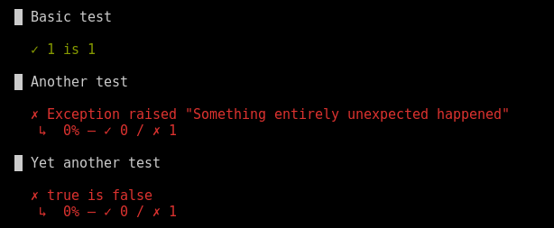

To declare a new test case you call the `describe(name, function)` function. Provide the required name and implementation function. 
Names should be unique within the script, otherwise, the test cases will to be grouped. 

Note: The first argument of the implementation function should be named `t`.

Behind the scenes, the `describe()` function creates a k6 [group](/javascript-api/k6/group-name-fn). 


| Parameter      | Type   | Description                                                                          |
| -------------- | ------ | ------------------------------------------------------------------------------------ |
| name  | string    | Test case name |
| function  | function    | The function to be executed |


### Returns

| Type    | Description                     |
| ------- | ------------------------------- |
| bool    | Returns true when all `expect` and `and` conditions within the `describe()` body were successful, and no unhandled exceptions were raised, otherwise false. |

### Example

<CodeGroup labels={[]}>

```javascript
import { describe } from 'https://jslib.k6.io/expect/0.0.4/index.js';
import http from 'k6/http';

export default function testSuite() {

  let success1 = describe('Basic test', (t) => {
    t.expect(1).toEqual(1)
  })

  console.log(success1); // true

  let success2 = describe('Another test', (t) => {
    throw("Something entirely unexpected happened");
  });

  console.log(success2); // false

  let success3 = describe('Yet another test', (t) => {
    t.expect(true).toEqual(false);
  });

  console.log(success3); // false

}
```

</CodeGroup>

Execution of this script should print the following output.




